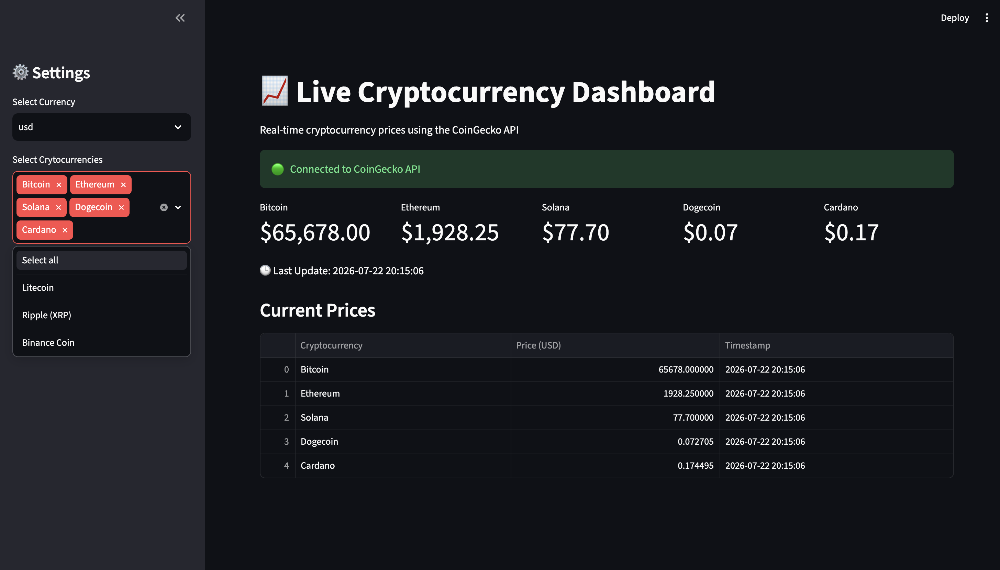
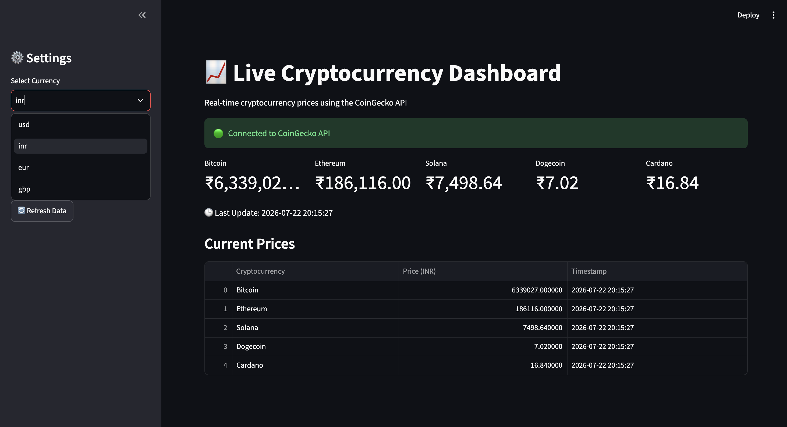

# Real-Time Cryptocurrency Dashboard

A live cryptocurrency dashboard built with Python and Streamlit that fetches real-time market prices from the CoinGecko API.

## Features

- Fetches live cryptocurrency prices using the CoinGecko REST API
- Displays Bitcoin, Ethereum, Solana and Dogecoin prices
- Shows the latest update timestamp
- API connection status indicator
- Automatically refreshes every 30 seconds
- Clean and interactive Streamlit interface
- Formatted live data table

## Technologies Used

- Python
- Streamlit
- Pandas
- Requests
- CoinGecko API

## Project Structure

```
Real-Time-Data-Analytics-Dashboard/
│
├── app.py
├── requirements.txt
├── README.md
├── images/
    └── dashboard.png

```

## Installation

Clone the repository

```bash
git clone https://github.com/Drashti-007/Real-Time-Cryptocurrency-Dashboard.git
```

Go into the project

```bash
cd Real-Time-Cryptocurrency-Dashboard
```

Install dependencies

```bash
pip install -r requirements.txt
```

Run the application

```bash
streamlit run app.py
```

## Dashboard Preview




## API Used

CoinGecko API

The dashboard retrieves live cryptocurrency prices directly from the CoinGecko public API.

## Learning Outcomes

This project helped me learn:

- Working with REST APIs
- Understanding JSON responses
- Fetching live data using the Requests library
- Building interactive dashboards with Streamlit
- Formatting and displaying data using Pandas
- Implementing automatic dashboard refresh
- Basic error handling for API requests


